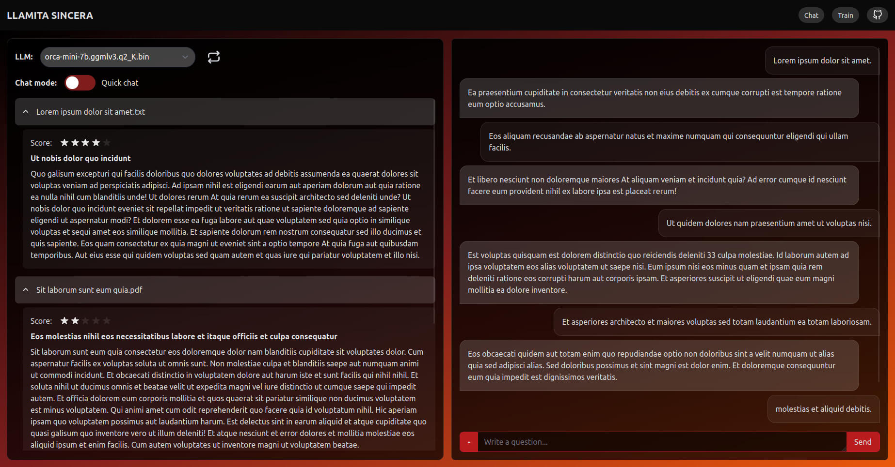

# Features

- AI-Powered Chats: "Llamita Sincera" uses the advanced Llama 2 AI model, creating more genuine and context-aware conversations.
- Offline Privacy: This app lets you train your AI using personal data offline. No need for internet access, keeping your information secure.

## Install

Linux:

- `pip install -r requirements.txt`
- `npm i`
- Download a language model and place it in the `models` folder. [List of LLMs](models/README.md)

(Windows and Mac versions in development)

## Run

- Start with `npm run llamita`
- Close with `ctrl+C` and then `ctrl+Z`

## Backend
- Llama 2
- Chroma DB
- Sentence Transformers
- Langchain
- Python
- Flask

## Frontend

- SvelteKit
- Typescript
- Tailwind
- Skeleton
